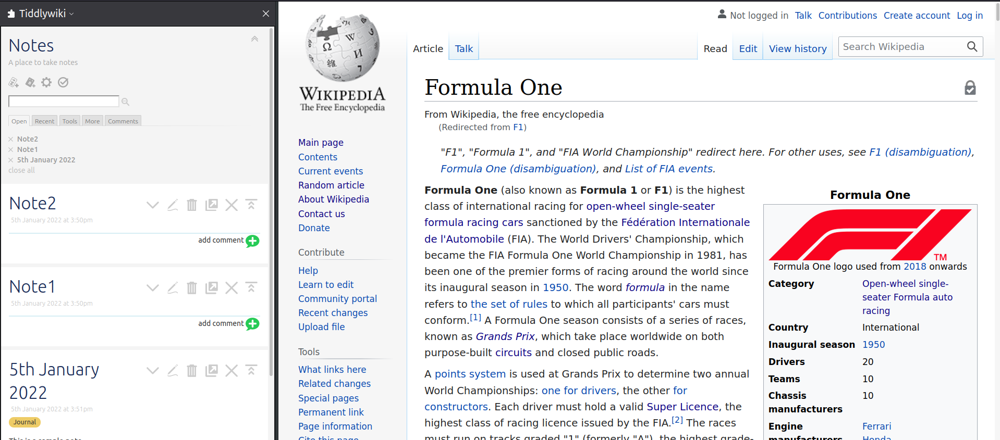

# tiddlywiki-firefox-extension
Embeds tiddlywiki on the sidebar. 

Shortcut key: Ctrl+Alt+Y

## Usage

* To install add-on to firefox click 
* Open a HTTP server on port 8001 (`python -m http.server 8001`) from the root of this directory.

## Testing and development
* Clone directory. 
* Open a HTTP server on port 8001 (`python -m http.server 8001`) from the root of this directory.

#### Manual way
* Open about:debugging on firefox and navigate to the 'This firefox' tab.
* Click 'Load temporary add-on' and point it to the manifest.json in this folder

#### Using nodejs and web-ext
* cd into the directory and enter `web-ext run`. This will install it as a temporary add-on

